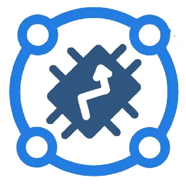
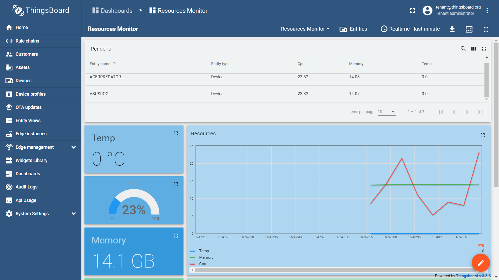

<div id="top"></div>
<!--
*** Thanks for checking out the Best-README-Template. If you have a suggestion
*** that would make this better, please fork the repo and create a pull request
*** or simply open an issue with the tag "enhancement".
*** Don't forget to give the project a star!
*** Thanks again! Now go create something AMAZING! :D
-->

<!-- PROJECT SHIELDS -->
<!--
*** I'm using markdown "reference style" links for readability.
*** Reference links are enclosed in brackets [ ] instead of parentheses ( ).
*** See the bottom of this document for the declaration of the reference variables
*** for contributors-url, forks-url, etc. This is an optional, concise syntax you may use.
*** https://www.markdownguide.org/basic-syntax/#reference-style-links
-->

[![Contributors][contributors-shield]][contributors-url]
[![Forks][forks-shield]][forks-url]
[![Stargazers][stars-shield]][stars-url]
[![Issues][issues-shield]][issues-url]
[![MIT License][license-shield]][license-url]
[![LinkedIn][linkedin-shield]][linkedin-url]

<!-- PROJECT LOGO -->
<br />
<div align="center">
  <a href="https://github.com/muame-amr/Thingsboard-REST">
    
  </a>

<h3 align="center">Thingsboard REST</h3>

  <p align="center">
    Automated assigment of device-customer, dashboard-customer and resource monitoring through REST service
    <br />
    <a href="https://github.com/muame-amr/Thingsboard-REST"><strong>Explore the docs »</strong></a>
    <br />
    <br />
    <a href="https://github.com/muame-amr/Thingsboard-REST">View Demo</a>
    ·
    <a href="https://github.com/muame-amr/Thingsboard-REST/issues">Report Bug</a>
    ·
    <a href="https://github.com/muame-amr/Thingsboard-REST/issues">Request Feature</a>
  </p>
</div>

<!-- TABLE OF CONTENTS -->
<details>
  <summary>Table of Contents</summary>
  <ol>
    <li>
      <a href="#about-the-project">About The Project</a>
      <ul>
        <li><a href="#built-with">Built With</a></li>
      </ul>
    </li>
    <li>
      <a href="#getting-started">Getting Started</a>
      <ul>
        <li><a href="#prerequisites">Prerequisites</a></li>
        <li><a href="#installation">Installation</a></li>
      </ul>
    </li>
    <li><a href="#usage">Usage</a></li>
    <li><a href="#license">License</a></li>
    <li><a href="#contact">Contact</a></li>
  </ol>
</details>

<!-- ABOUT THE PROJECT -->

## About The Project



This program able to:

- Read details from text file:
  - customer name
  - device name
- Create new a customer
- Create devices from the text file
- Assign the devices to the customer
- Assign the (manually created) dashboard to the customer (import dahsboard json file)
- Reads this data live from your laptop and sends it to the dashboard:
  - CPU usage
  - Memory usage
  - Temperature

<p align="right">(<a href="#top">back to top</a>)</p>

### Built With

- [Java](https://www.java.com/en/)
- [Maven](https://maven.apache.org//)
- [Thingsboard](https://thingsboard.io/)

<p align="right">(<a href="#top">back to top</a>)</p>

<!-- GETTING STARTED -->

## Getting Started

This is an example of how you may give instructions on setting up your project locally.
To get a local copy up and running follow these simple example steps.

### Prerequisites

Instructions below are provided for Windows 10/8.1/8/7 32-bit/64-bit. Hardware requirements depend on chosen database and amount of devices connected to the system. To run ThingsBoard and PostgreSQL on a single machine you will need at least 2Gb of RAM.

### Installation

1. Follow installation instructions [here](https://thingsboard.io/docs/user-guide/install/windows/)
2. Install [Open Hardware Monitor](https://openhardwaremonitor.org/)

<p align="right">(<a href="#top">back to top</a>)</p>

<!-- USAGE EXAMPLES -->

## Usage

1. Open OpenHardwareMonitor and let it run in the background
2. Edit `src/main/resources/tenantCustomer.txt` according to the format shown below:

```
<user1>,<device1>
<user2>,<device2>
```

3. Run `src/main/java/rest/post/ResourceMonitor.java`

<p align="right">(<a href="#top">back to top</a>)</p>

<!-- LICENSE -->

## License

Distributed under the MIT License. See `LICENSE.txt` for more information.

<p align="right">(<a href="#top">back to top</a>)</p>

<!-- CONTACT -->

## Contact

Your Name - [@mu4m3](https://twitter.com/mu4m3) - m.amiruddin27@gmail.com

Project Link: [https://github.com/muame-amr/Thingsboard-REST](https://github.com/muame-amr/Thingsboard-REST)

<p align="right">(<a href="#top">back to top</a>)</p>

<!-- MARKDOWN LINKS & IMAGES -->
<!-- https://www.markdownguide.org/basic-syntax/#reference-style-links -->

[contributors-shield]: https://img.shields.io/github/contributors/muame-amr/Thingsboard-REST.svg?style=for-the-badge
[contributors-url]: https://github.com/muame-amr/Thingsboard-REST/graphs/contributors
[forks-shield]: https://img.shields.io/github/forks/muame-amr/Thingsboard-REST.svg?style=for-the-badge
[forks-url]: https://github.com/muame-amr/Thingsboard-REST/network/members
[stars-shield]: https://img.shields.io/github/stars/muame-amr/Thingsboard-REST.svg?style=for-the-badge
[stars-url]: https://github.com/muame-amr/Thingsboard-REST/stargazers
[issues-shield]: https://img.shields.io/github/issues/muame-amr/Thingsboard-REST.svg?style=for-the-badge
[issues-url]: https://github.com/muame-amr/Thingsboard-REST/issues
[license-shield]: https://img.shields.io/github/license/muame-amr/Thingsboard-REST.svg?style=for-the-badge
[license-url]: https://github.com/muame-amr/Thingsboard-REST/blob/master/LICENSE.txt
[linkedin-shield]: https://img.shields.io/badge/-LinkedIn-black.svg?style=for-the-badge&logo=linkedin&colorB=555
[linkedin-url]: https://linkedin.com/in/muame
